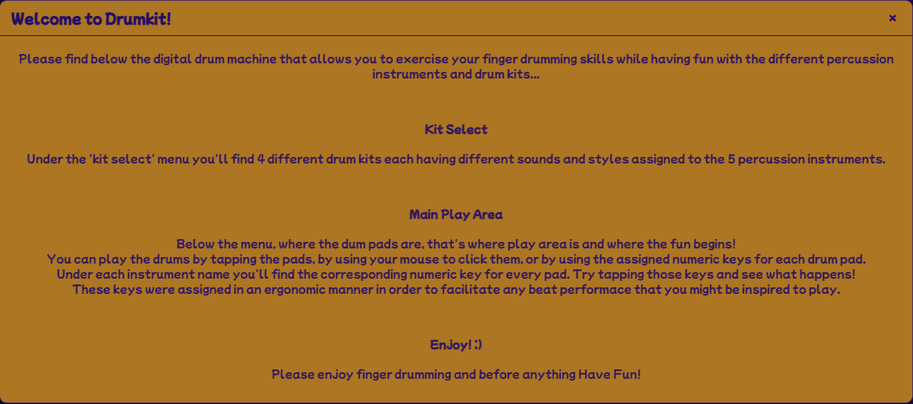
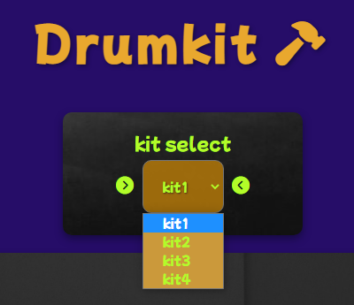

# Drumkit 
## Play Drums Application
- Drumkit is a simple, intuitive, easy to use drumming application, 
that aims to facilitate the exercise of rithmic abilties for the music enthusiasts regrdless of their age! 

## Features
- The Drumkit has a minimalist design with a couple of features that makes it fun to use and explore different percussive sounds. 
- Besides the minimalist and easy to use interface the colors and the font used for this application were chosen to suggest a playful and inspiring environment.
- At the top the application title is placed with a hammer that represents the percusive nature of this application.
- Below the title, the user can find a dropdown menu to select one of the four drum kits, and under this menu the drum pads are placed as the main interactive area. 
- The drum pads have a suggestive background image of a drum kit.

### Build Features
- Above the title element the instruction modal was placed under a reactive question mark that will reveal a short user guide once it's clicked on.  
- The header element placed on top, representing the name of the application "Drumkit" is interactive in nature and will change color when hovered over. 
- Immediately below the title a dropdown menu is placed for the user to change the drumkit sounds for all the drum pads / buttons.
- The drum pads are placed under the kit select area over the main interactive section.  

- __"?" The instruction modal__

- 
- Meant to awake the curiosity of the user, at the very top of the page, a stylish reactive question mark button is placed that will reveal a short user guide once it's clicked on.
- The user guide is meant to quickly instruct the user about the interactive areas and how they are used. 
- This was achieved with the use of modals in Java Script and it opens a scroll through window that will sit on top of the page until closed. 
- The styling for this user guide also creates an overlay that shadows the rest of the web page as long as the modal is open.
- In order to close the modal the user cal either click on the upper right corner of the instruction window where the 'x' symbol is placed or click anywhere over the background overlay.
- 

- __Kit select__
- The "kit select" menu features a total of four drum kits, each containing 5 sounds in total:
  - kick, snare, perc (percussion), hihat and crash (cymbal).
- This dropdown menu is interactive in nature and the text will change color when hovered over.
- The sounds presented in each kit are different in style and offer an inspiring range of percussive elements of the same kind (kick, snare, perc, hihat & crash).
- 

- __Drum pads__
- The last and most important interactive part is the drum pads/ buttons area where the user can interact with each assigned button in order to play the percussive elements.
- Each button was designed to be reactive and will change the font color and the size when hovered over, when tapped, played by the assigned numeric key or when clicked on!
- Also each button features a different minimalist circle symbol that was selected per sound which is meant to represent that specific instrument.
- This area has a inspiring background that respresents a black and white photography of an acousitc drum kit. 
- The photographic background suggests the higher importance of this area as being the "playground" or the main interactive part.
- 

-__Footer credits__
- At the very bottom of the page a footer note is placed, meant to give credits to the author of this application and to guide the user towards the linkedin and Github pages of the author.
- The links towards the social pages is done with the use of fontawesome icons that will react once hovered over and will pop the assigned link in a new tab once clicked on!
- 

### Followup Features
- Should this application receive a positive feedback from the music enthusiasts, a few followup features would include:
  - Integration of another 7 drum pads and the structuring of the drum pads as a full piano octave that presents 7 white keys and 5 black keys.
    - this feature would facilitate then a further on matching of the plugin with the MIDI protocol and the ability to play each drum pad as from a midi keyboard.
  - Addition of more than ten drum kits in order to have a rich variation of sounds
  - An extra importrarnt feature that would allow the user to also change sounds per drum pad enabling combinations of sounds from all drum kits. This feature would ofcourse respect the drum pad/ button type allowing only a sellection of the same type of percussive instrument => kick - kick1, kick2, kick3 etc.
  - Another extra feature would enable the user to save personal drum kit combinations, with the preffered souns sellected for each drum pad. 

## Testing 
- The responsive web design was tested extensively with the inspector toll on Google Chrome and Microsoft Edge browsers.
- Both the scaling and functionality are working perfectly well from 4K down to 1024px and as low as 375px.
- Please find below screenshots from both browsers:
  - ### Microsoft Edge
  - 
  - 
  - 

  - ### Google Chrome
  - 
  - 
  - 
### Bugs & issues
- One issue that was detected is related to the mobile screen, more precise to the double and tripple tap action that will trigger the zoom in function on iPhones instead of playing the sound assigned to the played drum pad. 
- This issue is directly related to the mobile environment and there's not much that can be done about it unless this aplication would be deployed as a stand alone app and not browser based. 

### Extra testing
- Extra testing was performed for the overall score of the website with the use of Lighthouse from inside the inspector tools in Google Chrome.
- The results are displayed below:
- 

### Validator Tests
- For the HTML file:
  - No errors were returned through the official
  - [W3C validator-index.html](https://validator.w3.org/nu/?doc=https%3A%2F%2Ftrikalex.github.io%2Fpp2-js-drumkit%2Findex.html)
  - 

- For the style.css file:
  - No errors were returned through the official
  - [(Jigsaw3) CSS-validator](https://jigsaw.w3.org/css-validator/validator?uri=https://trikalex.github.io/pp2-js-drumkit)
  - 

- For script.js file:
  - No errors were returned through the official
  - [jshint.com](https://jshint.com/)
  - 

### Unfixed Issues
- No unfixed issues were left.

## Deployment

The site was deployed to GitHub pages. The steps to deploy are as follows: 
  - In the [GitHub repository](https://github.com/trikalex/pp2-js-drumkit), navigate to the Settings tab 
  - From the source section drop-down menu, select the **Main** Branch, then click "Save".
  - The page will be automatically refreshed with a detailed ribbon display to indicate the successful deployment.

The live link can be found [here](https://trikalex.github.io/pp2-js-drumkit/)

### Local Deployment

You can clone the repository by following these steps:

1. Go to the [GitHub repository](https://github.com/trikalex/pp2-js-drumkit) 
2. Locate the Code button above the list of files and click it 
3. Select if you prefer to clone using HTTPS, SSH, or GitHub CLI and click the copy button to copy the URL to your clipboard
4. Open Git Bash or Terminal
5. Change the current working directory to the one where you want the cloned directory
6. In your IDE Terminal, type the following command to clone my repository:
	- `git clone https://github.com/trikalex/pp2-js-drumkit.git`
7. Press Enter to create your local clone.

Alternatively, if using Gitpod, you can click below to create your own workspace using this repository.

## Credits 

- ### Code
- Most of the code used for creating this application was covered in the Java Script Essentials, Comparative Programming Languages Essentials and also Love Maths project.
- However as a source of inspiration for the drum pads/ buttons and the modal function two YouTube sources were used in the process:
  - 1. The [JavaScript King](https://www.youtube.com/@JavaScriptKing) channel
  - 2. The [Web Dev Simplified](https://www.youtube.com/@WebDevSimplified) channel

- ### Content
- All sounds used for each of the drum kits are part of a personal sample library bought and owned by the creator of this application.

- ### Media
- The Background image for the drum pads area was taken from unsplash.com, a free stock photos website.
- The icons used in the title and on the drum pads area are part of the free Fontawesome library.